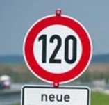

# **Traffic Sign Recognition** 

**Build a Traffic Sign Recognition Project**

The goals / steps of this project are the following:
* Load the data set (see below for links to the project data set)
* Explore, summarize and visualize the data set
* Design, train and test a model architecture
* Use the model to make predictions on new images
* Analyze the softmax probabilities of the new images
* Summarize the results with a written report
## Data Set Summary & Exploration
### 1. Basic data statistics

I used the numpy library to calculate summary statistics of the traffic
signs data set:

* The size of training set is ?
* The size of the validation set is ?
* The size of test set is ?
* The shape of a traffic sign image is ?
* The number of unique classes/labels in the data set is ?

### 2. Exploratory visualization of the dataset

Here is an exploratory visualization of the data set. It is a bar chart showing how the data is distributed across 43 traffic signs.

![Dataset analysis][results/dataset.png]

## Design and Test a Model Architecture

### 1. Data Preprocessing
Since some traffic signs have very little data I have decided to create fake data form them by using the existing images and translating them across x and y axis in order to increase dataset.
Then I decided to convert the images to HLS to make traffic sign lines more visible. Than traffic signs are then converted to grayscale and normalized.

Here is an example of input image and the output we get when pipelined:

### 2. NN Architecture

My final model consisted of the following layers:

| Layer         		|     Description	        					|
|:---------------------:|:---------------------------------------------:|
| Input         		| 32x32x1 RGB image   							|
| Convolution 3x3     	| 1x1 stride, VALID padding, outputs 28x28x6 	|
| RELU					|												|
| Max pooling	      	| 2x2 stride, VALID padding, outputs 14x14x6 	|
| Convolution 3x3	    | 1x1 stride, VALID padding, outputs 10x10x16   |
| Max pooling   		| 2x2 stride, VALID padding, outputs 5x5x16 	|
| RELU  				|           			    					|
| Fully connected		| 400 Input, 120 Output							|
| RELU					|												|
| Fully connected       | Input 120, Output 84                          |
| RELU                  |                                               |
| Fully connected       | Input 84, Output 43                           |
### 3. Hyperparameters

To train the model, I used an multiple combinations to find the best fit, I have tried with learning rates of:
 - 0.001
 - 0.01
 - 0.005
 - 0.05
, and the best was for my model was 0.001. I have tried various batch sizes:
 - 100
 - 128
 - 256
 - 300
, and the batch size of 128 has yielded the best results. To improve model accuracy I have tried number of epochs between 10 and 15, and of bigger number of epoch has yielded better results. For an optimizer I have chosen Adam optimizer.

### 4. Results

My final model results were:
* training set accuracy of 0.91
* validation set accuracy of 0.936
* test set accuracy of 0.91

The architecture that was chosen for training was a LeNet architecture since that architecture has proven to be great for object detection and classification problems. And the results on training, validation and test datasets confirm that was a valid choice.

## Test a Model on New Images

### 1. Randoms selected images

Here are five German traffic signs that I found on the web:

  
 

Road work and No passing were also misclassified. The problem is that the original images are of different size and quality and they had to be resized to fit LeNet NN, and that dropped the quality of images. The JPG format if images are compressed images and their quality was already compromised, and the resizing escalated that.

### 2. Accuracy on new images

Here are the results of the prediction:

| Image			        |     Prediction	        					|
|:---------------------:|:---------------------------------------------:|
| Keep right      		| Keep right   									|
| Speed limit (120km/h) | Speed limit (120km/h)                         |
| Road work				| Right-of-way at the next intersection			|
| Roundabout mandatory  | Roundabout mandatory			 		        |
| No passing			| Slippery road           						|

The model was able to correctly guess 3 of the 5 traffic signs, which gives an accuracy of 60%. This compares negatively to the accuracy on the test set.

#### 3. Top 5 probabilities for new images

The code for making predictions on my final model is located in the cell of the Ipython notebook.

For the first image, the model is relatively sure that this is a ahead only (probability of 100), and the image does contain a stop sign. The top five soft max probabilities were:

Sign Keep right top 5 picks:
 1. Keep right: 100.0
 2. Bicycles crossing: 0.0
 3. Dangerous curve to the right: 0.0
 4. Turn left ahead: 0.0
 5. General caution: 0.0

Sign Speed limit (120km/h) top 5 picks:
 1. Speed limit (120km/h): 99.99998
 2. Speed limit (100km/h): 2e-05
 3. Speed limit (20km/h): 0.0
 4. Speed limit (80km/h): 0.0
 5. Speed limit (70km/h): 0.0

Sign Road work top 5 picks:
 1. Right-of-way at the next intersection: 99.99646
 2. Beware of ice/snow: 0.00218
 3. Priority road: 0.00109
 4. Go straight or left: 0.0002
 5. Roundabout mandatory: 4e-05

Sign Roundabout mandatory top 5 picks:
 1. Roundabout mandatory: 100.0
 2. Slippery road: 0.0
 3. Dangerous curve to the right: 0.0
 4. Vehicles over 3.5 metric tons prohibited: 0.0
 5. Priority road: 0.0

Sign No passing top 5 picks:
 1. Slippery road: 65.24997
 2. Beware of ice/snow: 14.12842
 3. Bicycles crossing: 10.04716
 4. Priority road: 6.8824
 5. Speed limit (20km/h): 3.15472

